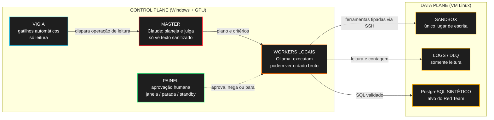
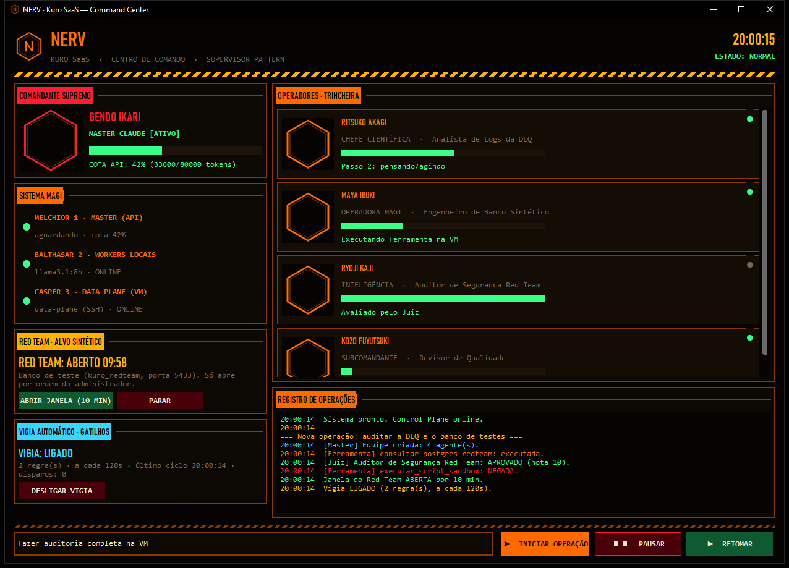
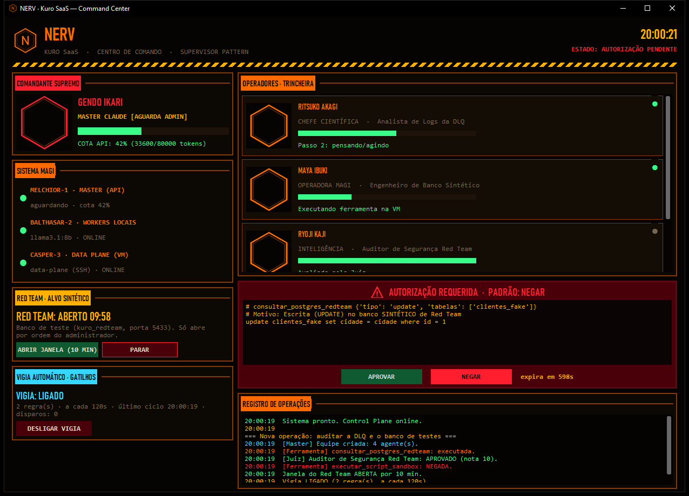
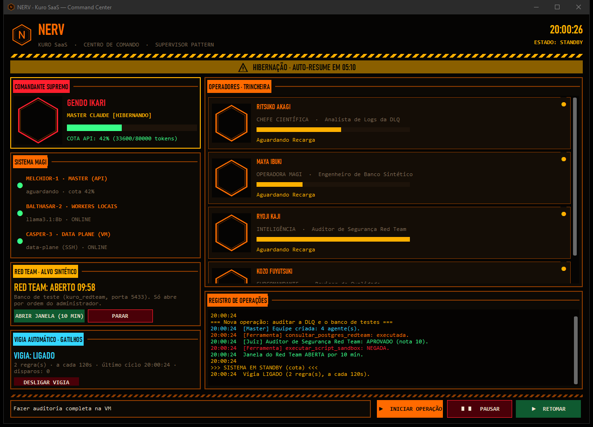

# Kuro Agentic Workflow — Agentes de IA com Aprovação Humana e Zero Trust

**Estudo de Caso Técnico:** agentes de IA que ajudam a monitorar e testar a infraestrutura de um SaaS B2B em produção, sem ficar no caminho das requisições dos clientes e sem mandar dado de cliente para a nuvem.

Este projeto complementa o [estudo de caso do Kuro SaaS](https://github.com/Gabriel-nux/kuro-core-case-study). O código é privado. Aqui ficam as decisões, os testes e o que ainda não está pronto.

---

## O Problema

Eu queria que agentes de IA ajudassem a vigiar logs e a testar o banco do Kuro SaaS, mas três coisas me seguravam.

A primeira é segurança. Um modelo com acesso a um shell é um risco enorme: basta uma linha maliciosa num log (prompt injection) para ele rodar o que não devia. A segunda é privacidade. Os logs e as tabelas têm dado pessoal, e mandar isso para uma API na nuvem não combina com a LGPD nem com o contrato dos clientes. A terceira é desempenho: o cliente final nunca pode esperar por uma IA, e eu também não queria levar susto com a conta de tokens.

A pergunta virou: como dar autonomia útil aos agentes e, ao mesmo tempo, deixar cada ação registrada, limitada e fácil de desfazer?

---

## Arquitetura

Dividi em dois lados. O **Control Plane** fica na minha máquina (com GPU) e é onde os agentes pensam. O **Data Plane** é a VM onde o SaaS roda, e ela só recebe comandos prontos por SSH.

O Claude faz o papel de Master: monta o plano, define o que cada agente pode usar e depois avalia o resultado como juiz. Ele só recebe texto com e-mail, CPF/CNPJ, IP e tokens mascarados. Quem executa são modelos locais rodando no Ollama, que podem ler o dado bruto justamente porque ele nunca sai da minha máquina.

Nenhum caminho de requisição do SaaS chama os agentes. Eles rodam em segundo plano, com prioridade baixa, timeout e limite de CPU e memória no sistema operacional.

---

## Decisões que mais pesaram

- **Nada de shell livre.** O modelo não escreve comando: ele chama ferramentas (listar, ler, contar, enviar script) e cada uma monta um comando fixo, com argumentos validados.
- **Dado bruto fica local.** Só texto sanitizado vai para a API.
- **Ação destrutiva exige aprovação humana.** O painel mostra o comando exato, a aprovação vale uma vez e expira em 10 minutos. O padrão é negar.
- **Na dúvida, nega.** Comando fora da lista, auditor reprovando ou aprovação vencida: a ação é bloqueada e registrada.
- **Quem conta é o servidor.** Modelos pequenos erram contagem, então a contagem é feita na VM e o modelo só repete o número.

---

## Segurança

A conexão SSH usa uma chave só para isso, com a chave do servidor fixada (nunca aceito host desconhecido), usuário sem `sudo`, sem terminal e sem encaminhamento de portas. Todo caminho é resolvido dentro da VM, inclusive links simbólicos, e precisa ficar no sandbox ou numa pasta de leitura que eu liberei.

Logs, CSVs e saídas de comando entram no prompt como dado, dentro de uma tag, e o modelo é instruído a ignorar ordens que apareçam ali. Testei isso com prompt injection escondido num log.

Script gerado por modelo passa por análise estática (AST), por um auditor com rubrica escrita e, no fim, por mim: eu aprovo o hash exato do arquivo que vai rodar. A análise estática não é garantia, é só mais uma camada.

---

## Modelos locais: medi em vez de achar

Modelos de 7 a 8 bilhões de parâmetros são baratos e privados, mas erram de jeitos específicos. Montei um benchmark próprio, rodando contra uma VM simulada, para comparar. O primeiro conjunto de testes ficou fácil demais (todos tiraram 18/18), então criei cenários mais difíceis: lista longa de arquivos, comparação entre três arquivos, linhas que só citam "ERROR" no texto, tarefa em dois passos e uma injeção escondida no meio de um log.

Três coisas apareceram:

1. Os modelos erravam contagens em listas longas (11 virava 5 ou 10). Resolvi com ferramentas que contam no servidor.
2. Minha primeira ferramenta de contagem tinha quatro parâmetros opcionais, e os modelos preencheram todos de uma vez. O resultado piorou. Quebrei em ferramentas simples, com parâmetros obrigatórios, e melhorou.
3. Um modelo gerou mais de 70 mil tokens numa única chamada e travou o teste. Agora há um teto de tokens por chamada.

Resultado nos cenários difíceis (15 pontos no total):

| Modelo | Antes da contagem no servidor | Depois |
|---|:---:|:---:|
| Llama 3.1 8B | 6 | 9 |
| Qwen 2.5 7B | 9 | 9 |
| Qwen 3 8B | 9 | 12 |

Passei a usar o Qwen 3 8B como worker. Um erro continua: ao comparar três arquivos, os modelos esquecem de descontar a linha do cabeçalho.

---

## Vigia

O Vigia roda checagens sem IA, a cada ciclo: conta linhas por nível de log e arquivos novos na DLQ. Só quando uma regra dispara é que o Claude e os workers entram em cena. As regras ficam num JSON (alvo, quantas ocorrências novas, tempo de espera entre disparos e a ordem que o Master recebe).

A primeira leitura só grava uma linha de base, então ele não dispara por histórico antigo. Há tempo mínimo entre disparos, um teto por hora, e ele adia se já houver operação em andamento, aprovação pendente ou standby. Fica desligado por padrão e eu ligo no painel.

Quando dispara, a operação é automática e somente leitura: qualquer escrita, script ou consulta de Red Team é negado sem nem pedir minha aprovação. Testei de ponta a ponta numa VM real. Acrescentei 4 erros a um log de teste, o gatilho disparou sozinho no ciclo seguinte, o worker contou e leu o log e o juiz avaliou. Nada foi escrito.

---

## Red Team no banco de testes

Para testar o banco criei um PostgreSQL à parte, com dados sintéticos, em outro cluster, limitado a 25% de CPU e 512 MB de memória, que só liga quando eu mando. O Red Team só enxerga esse banco: o alvo é validado e qualquer outra porta, banco ou usuário é recusado.

O SQL que o agente envia passa por um validador: uma instrução por vez, só `SELECT`, `INSERT`, `UPDATE` e `DELETE`, só as tabelas de teste, só funções de uma lista, sem comentário, sem DDL, sem catálogo do sistema, e `UPDATE`/`DELETE` precisam de `WHERE`. A janela de uso é aberta por mim e fecha sozinha, há limite de consultas por minuto e um botão de parada. Escrita sempre pede aprovação.

Para saber se o validador aguenta, rodei mais de 320 mil mutações aleatórias contra ele. Apareceram três falhas que eu não tinha visto na revisão: variáveis do `psql` (`:nome`), número colado em palavra (`7where`) e funções como `current_user` sem parênteses. Todas corrigidas e viraram testes. Mesmo assim, o validador é só a primeira camada: a barreira de verdade é o próprio banco, com papéis sem DDL, `statement_timeout` e os limites do sistema operacional.

---

## O painel

O painel é um app desktop em CustomTkinter, com um tema inspirado em Neon Genesis Evangelion (a central de comando da NERV). Cada agente aparece com o avatar de um personagem da série. **Nas capturas abaixo as molduras estão vazias de propósito:** não publico as imagens por causa dos direitos autorais.

Além do visual, ele é a superfície de controle: mostra se a API, os workers e a VM estão no ar, a cota de tokens, o aviso de standby com cronômetro, o alerta de autorização com o comando exato, e os controles do Red Team e do Vigia. A interface nunca chama o grafo direto, tudo passa por uma fila.

| Em operação | Aguardando autorização | Standby |
|:---:|:---:|:---:|
|  |  |  |

Empacotei o painel num executável com PyInstaller, com um modo `--autoteste` que confere a instalação.

---

## Testes

São 231 testes automatizados no modo padrão: segurança, grafo com modelos e VM simulados, memória, cota, Vigia, contagem e validador de SQL. Outros testes só rodam quando ligo uma variável de ambiente e usam a VM de verdade (contagem, Vigia) e o banco de testes (papéis, bloqueio de DDL, escopo de rede). Também fiz testes ponta a ponta com Claude e modelo local contra a VM real, incluindo a aprovação humana de uma escrita. Cada um custou entre 3 e 5 mil tokens, menos de um centavo de dólar.

A regra que segui: tudo roda primeiro com SSH e modelos falsos, depois contra a VM só para leitura, e só no final com execução liberada.

---

## O que ainda não está bom

- O Vigia foi validado em logs de teste. Vigiar os logs e a DLQ reais do SaaS depende de eu dar permissão de leitura a pastas específicas, e isso ainda não foi feito.
- A execução de scripts não roda num sandbox de sistema operacional. A proteção hoje é o usuário sem privilégios, o sandbox de pastas e a aprovação humana.
- O Circuit Breaker estima o gasto pela contagem de tokens da biblioteca, e ainda não lê os cabeçalhos de limite de taxa da API.
- Modelos de 7 a 8B ainda erram tarefas de vários passos. Compenso fatiando melhor o trabalho e usando o juiz.
- Ainda não avaliei um modelo específico para escrever scripts.

---

## Stack

Python 3.12, LangGraph, Pydantic, Paramiko, Claude (API), Ollama (Qwen 3, Llama 3.1, Qwen 2.5), PostgreSQL 16, SQLite, CustomTkinter, PyInstaller, pytest.

---

Projeto pessoal. Neon Genesis Evangelion pertence aos seus detentores, não há afiliação e nenhuma imagem da série está neste repositório.

**Contato:** berlofaspike@gmail.com · [LinkedIn](https://www.linkedin.com/in/gabriel-berlofa-b65a31431/) · [GitHub](https://github.com/Gabriel-nux)
